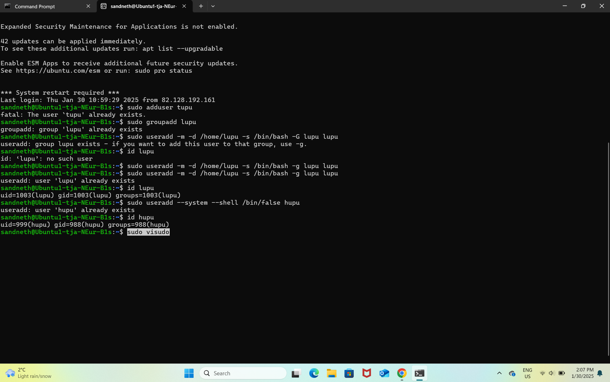
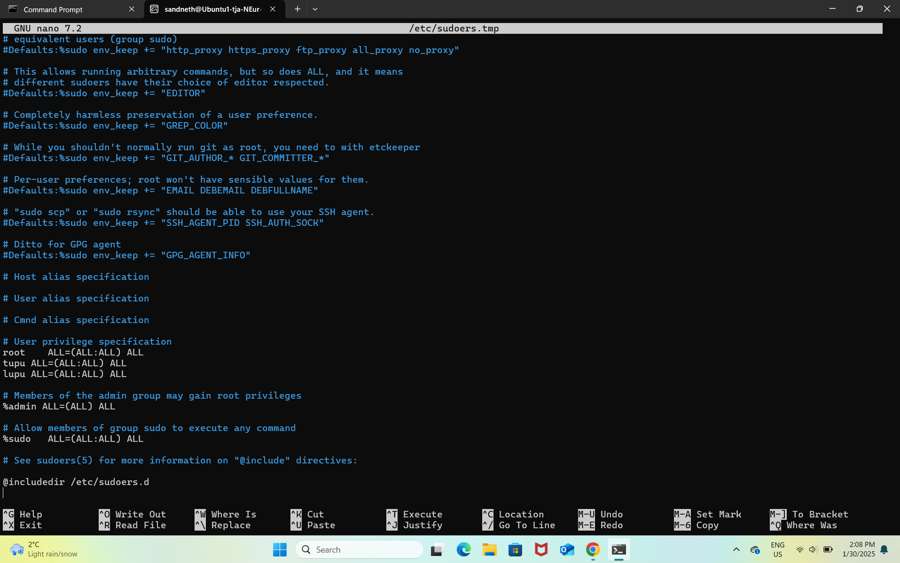
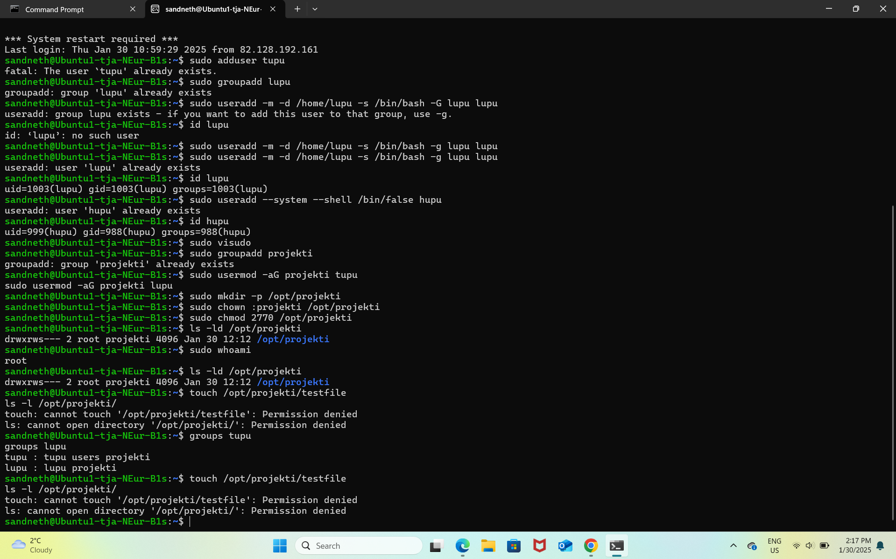

2025-01-30 - Task Documentation: Steps 1-5

Task 1: Create the Tupu User
Command:sudo adduser tupu
Explanation:
Created a new user tupu using the adduser command.
A home directory /home/tupu was automatically created.
Followed the prompts to set a password and other user information.

Task 2: Create the Lupu User
Command:sudo useradd -m -d /home/lupu -s /bin/bash -G lupu lupu
Explanation:
Created a new user lupu with a home directory /home/lupu, login shell /bin/bash, and added to the lupu group.
If the group lupu does not exist, it must be created beforehand.

Task 3: Create the Hupu System User
Command:sudo useradd --system --shell /bin/false hupu
Explanation:
Created a system user hupu with the shell set to /bin/false, which disables login for this user.

Task 4: Add Users to the Sudo Group
Command:sudo usermod -aG sudo tupu
        sudo usermod -aG sudo lupu
Explanation:
Added tupu and lupu to the sudo group to grant them sudo privileges.

Task 5: Create /opt/projekti and Set Permissions
Step I:Create the Common Group
Command:sudo groupadd projekti
Step II:Add Both Users to the Group
Command:sudo usermod -aG projekti tupu
        sudo usermod -aG projekti lupu
Step III:Create the /opt/projekti Directory
Command:sudo mkdir -p /opt/projekti
Step IV:Set Group Ownership
Command:sudo chown :projekti /opt/projekti
Step V:Set Permissions
Command:sudo chmod 2770 /opt/projekti
Step VI:Verify
Command:ls -ld /opt/projekti

Screenshots

